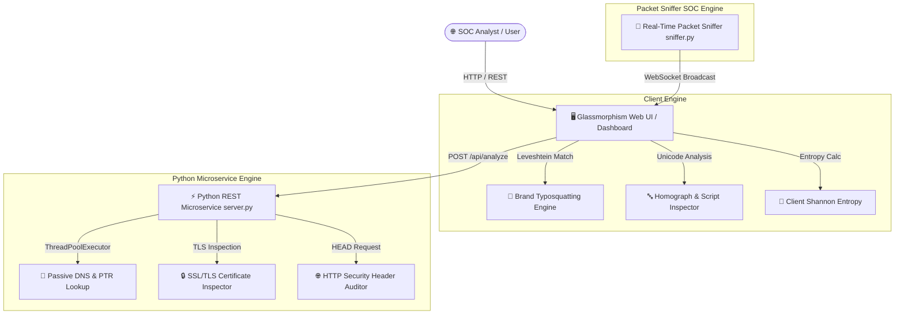

# 🛡️ UnFurl Cybersecurity Hub // Unified SOC & Telemetry Dashboard

[](https://opensource.org/licenses/MIT)
[](https://www.python.org/)
[](https://render.com)
[](#security--privacy)

**UnFurl Cybersecurity Hub** is an advanced, enterprise-grade cybersecurity microservice platform and SOC dashboard engineered for real-time URL threat intelligence, phishing domain forensic inspection, and active network telemetry analysis. 

Combining client-side mathematical heuristics with high-concurrency Python backend engines, UnFurl detects sophisticated cyber attacks—including **Cyrillic/Greek IDN homograph spoofs**, **Levenshtein typosquatting**, **randomized DGA domains**, and **unsecured HTTP server configurations**.

---

## 📐 Architecture Overview



---

## ✨ Core Key Features

### 🔎 1. URL Threat Analyzer Engine
* **Levenshtein Brand Spoofing Detection**: Automatically cross-references incoming target hostnames against high-profile target brands (e.g., PayPal, Google, Microsoft, Coinbase, Meta) calculating edit distance to flag typosquatted domains.
* **Homograph Glyph & Script Inspector**: Parses raw character unicode codepoints to catch mixed-script glyph attacks (e.g., substituting Latin `'a'` with Cyrillic `'а'`).
* **Shannon Entropy Algorithmic Calculation**: Evaluates string randomness to catch algorithmically generated domains (DGA) commonly utilized by botnets and C2 ransomware nodes.
* **Authority Override & Credential Stealing Alerts**: Flags URL user-authority override exploits (e.g., `user:password@malicious-host.com`).

### ⚡ 2. Python Security Telemetry Microservice
* **Passive DNS & Reverse PTR Resolution**: Queries target IP ranges, identifying reverse pointer records and preventing internal network SSRF exposure.
* **SSL/TLS Certificate Deep Inspection**: Verifies certificate validity, issuer organization details, TLS protocol versions, and Subject Alternative Names (SANs).
* **HTTP Security Hardening Audit**: Queries security headers in real-time, auditing HSTS, Content Security Policy (CSP), X-Frame-Options, and X-Content-Type-Options.

### 📡 3. Real-Time SOC Packet Sniffer & Telemetry
* Intercepts live IP/TCP/UDP packets with automatic threat classification on sensitive infrastructure ports (SSH `22`, Telnet `23`, SMB `445`, RDP `3389`).
* Includes a dynamic WebSocket stream and interactive Chart.js protocol breakdown.

---

## 📁 Repository Directory Structure

```
UnFurl/
├── index.html          # Unified SOC & Analyzer Dashboard UI
├── styles.css          # Dark-mode Cyberpunk Design System
├── analyzer.js         # Client-side heuristic logic & API controller
├── sniffer.js          # Real-time WebSocket packet stream controller
├── server.py           # Python REST Telemetry API & Static Web Server
├── sniffer.py          # Real-time packet sniffer microservice
├── requirements.txt    # Python runtime dependencies
├── render.yaml         # Render.com Infrastructure-as-Code blueprint
├── LICENSE             # MIT License
└── README.md           # Professional Documentation
```

---

## 🚀 Local Setup & Development

### 1. Prerequisites
Ensure you have Python 3.10+ installed on your system.

### 2. Installation
Clone the repository and install the required dependencies:
```bash
git clone https://github.com/your-username/UnFurl.git
cd UnFurl
pip install -r requirements.txt
```

### 3. Running the Microservices
Start the primary server microservice (serves both the REST API and static web application):
```bash
python server.py
```
* Access the web dashboard in your browser at: **`http://localhost:8000`**
* REST API health check endpoint: **`http://localhost:8000/api/health`**

*(Optional)* Launch the real-time network sniffer microservice:
```bash
python sniffer.py
```

---

## 📡 REST API Specification

### Analyze Target URL
* **Endpoint**: `POST /api/analyze`
* **Content-Type**: `application/json`
* **Request Body**:
  ```json
  {
    "url": "https://paypal.com.account-verify.attacker.xyz"
  }
  ```
* **Response Body**:
  ```json
  {
    "target_url": "https://paypal.com.account-verify.attacker.xyz",
    "hostname": "paypal.com.account-verify.attacker.xyz",
    "entropy": {
      "score": 3.942,
      "is_high_entropy": true
    },
    "suspicious_tld": true,
    "dns_telemetry": {
      "resolved_ips": ["192.0.2.1"],
      "is_private_ip": false,
      "dns_success": true,
      "reverse_ptr": "mail.attacker.xyz"
    },
    "ssl_telemetry": {
      "has_ssl": true,
      "issuer": "Let's Encrypt",
      "version": "TLSv1.3"
    }
  }
  ```

---

## 🌐 Live Deployment on Render.com

This repository is optimized for one-click live deployment on **Render.com**.

### Option A: Automatic Blueprint Deployment (Recommended)
1. Fork or push this repository to your GitHub account.
2. Log in to your [Render Dashboard](https://dashboard.render.com/).
3. Click **New +** and select **Blueprint**.
4. Connect your GitHub repository. Render will automatically detect `render.yaml` and configure the service environment!

### Option B: Manual Web Service Setup
1. On Render Dashboard, click **New +** -> **Web Service**.
2. Select your repository.
3. Configure the following build & runtime settings:
   * **Runtime**: `Python`
   * **Build Command**: `pip install -r requirements.txt`
   * **Start Command**: `python server.py`
4. Click **Create Web Service**. Render will automatically assign a public HTTPS URL (e.g., `https://unfurl-cybersecurity-hub.onrender.com`).

---

## 🔒 Security & Privacy Audit

* **Zero Hardcoded Secrets**: Scanned to verify no private keys, tokens, or personal identifiers are committed.
* **Directory Traversal Protection**: Integrated sanitization within `server.py` prevents access to files outside the application root.
* **Clean Environment**: `.gitignore` is pre-configured to exclude local environment variables (`.env`), database logs, and OS caches.

---

## 📜 License

Distributed under the **MIT License**. See [`LICENSE`](LICENSE) for more information.
